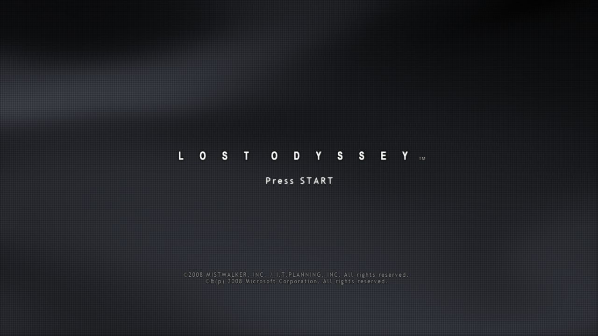

# macOS Metal: first title-screen frame (2026-09-14)

First frame of the game rendered natively on Metal on Apple Silicon, from the
`macos` branch. No MoltenVK or translation layer: guest shaders go Xenos → HLSL →
DXIL (DXC) → Apple Metal Shader Converter → plume `METAL_IR` pipelines.

## Environment

- Apple M4 Pro (Mac16,11), 24 GiB, macOS 27.0 (26A428), Xcode 27.0.
- `cmake --preset macos-clang`, USA/Europe v0.0.0.3 disc 1.
- Internal resolution 2560×1440 (2× the 1280×720 guest frontbuffer).

## What was verified

- Renderer initialisation on Metal converts all 28,484 known game shaders; the
  same 2 shaders fail as on the other backends. Cold preparation took about 66 s
  on 11 workers; a warm `.plir` cache initialises in about 1 s.
- The title screen above is the resolved guest frontbuffer (surface `0x714000`)
  read back after 900 swaps. The same image is presented in a native macOS
  window through the presentation pipeline, at a steady 30 fps.
- No Metal API validation failures with `MTL_DEBUG_LAYER=1`.
- GPU fixtures pass on Metal: `LoResolveCopyGpuTest`, `LoStencilTest` and
  `LoMetalBackendTest` (renderer-shaped root CBVs b0–b2, byte-address buffers,
  texture tables).

## Fixes this milestone needed

- Depth resolves draw the depth aspect into the R32F surface, as on Vulkan:
  Metal blit copies cannot reinterpret D32/S8 storage as R32F.
- Guest frames are RGBA8 but CAMetalLayer requires a BGRA8 swap chain. The GPU
  present path compared against the swap chain format, so Metal fell back to
  CPU untiling and presented black.

## Not yet verified or implemented

- Rect lists: Metal has no geometry stage. The title screen issues 35 of them per
  frame; they are currently drawn as a single triangle each until a vertex-shader
  expansion replaces the GS.
- Comparison against D3D12 reference captures (title, Map2, city, battle,
  occlusion-query characters).
- Gameplay past the title screen, input, and audio output on Metal builds.
- MetalFX, frame interpolation, native GameController and spatial audio are
  later milestones of the port.
